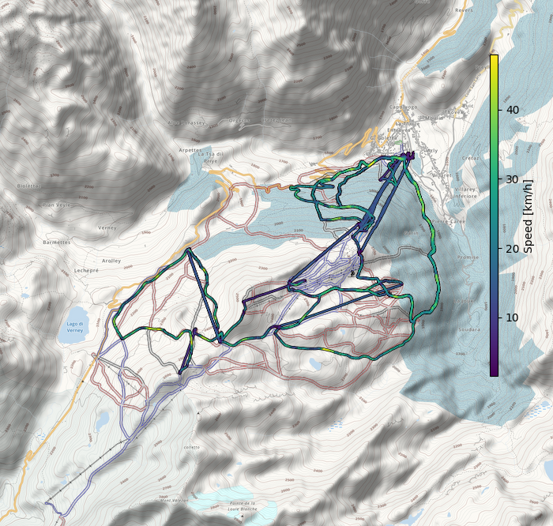

# fitfile-jugglers

## AIM

Use garmin devices without cloud and app. Get the files (copy through usb) and
start nerding yourself.

Watch a lightning talk about the problem [here](https://media.ccc.de/v/FT7A7U).

## what's there (or, well, drafted)

### `fit2gpx.sh`

A command line call to gpsbabel to convert fit files to gpx, with the garmin
extensions enabled (heart rate, cadence for cycling, temperature.)

Does not work at the moment for newer garmin files (2.0) e.g. from the [skiing
app](https://apps.garmin.com/de-DE/apps/47e87496-459b-46a0-8b9d-c344cb0d1df9).

### `half_marathon.py`

Some plotting from the record of a half marathon, when two half marathon runs
are stored in one gpx file, as exported from garmin basecamp.

### `hiit.py`

Show heart rate during a HIIT session. Shows also whenever you hit the lap
button. Interactive matplotlib plot, png output and an interactive html file
(lots of external JS loaded, no idea if the JS module calls home).

### `steps.py`

A parser of the acivity tracking (in `MONITOR/` on garmin watches), shows your
steps throughout the day.

### `swim.py`

Heart rate parsing for indoor swimming. (haven't figured out the timestamps
yet).

### `ski.py`

Plot altitude, heart rate, and speed vs. time. detect changes from lift to
piste, print stats on ski distance and descent and lift distance and ascent.

NB: final statistics don't agree with the in-app stats.

### `skimap.py`

Plot the track on a map and colorize the track according to velocity (or hear
rate, or other variable).

(map data (c) www.openstreetmap.org & contributors published under ODBL; map tiles by www.opensnowmap.org published under CC-BY-SA; the track overlay added by pseyfert, CC-BY-SA).

## unit tests and references

I would love to let you help and hack around, but, you know, I have
reservations putting some .FIT recordings of myself on the internet (other than
what I somewhat had to share with Garmin, to get a "reference" reading, files
are marked as private there and mostly deleted, but that's on trust basis and I
don't want to make it worse).

## requirements

I'm using:
 * [python-fitparse](https://github.com/dtcooper/python-fitparse) commit 5283af577d593bfb11bdc582c7d2df61b6ce3c40
 * [gpxpy](https://github.com/pseyfert/gpxpy.git) with my commit 4449b9cb7b852ccd4068b712d99e71e9139826c4 (from [here](https://github.com/podusowski/gpxpy/commit/e9b73b12b84371e0d4908155835469f2704abfe9)).
 * [TileMapBase](https://github.com/MatthewDaws/TileMapBase) from commit 7e253c0b1b41ea8c22e3c6a49aec62675d006452

Most scripts have been written for python 2.7, though porting them to python
3.5 (or making them compatible) shouldn't be hard. Those relying on TileMapBase
even are written for python 3.

## LICENSE

The project is published under the [MIT license](LICENSE). This does not include:

 * example outputs in the `outputs` directory (CC-BY-SA, see above)
 * some files imported from other projects:
   - `setup.cfg` (GPL)
